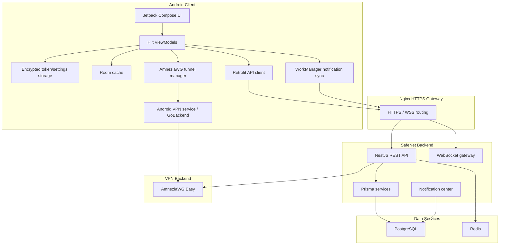

# SafeNet VPN Platform - Implementation Walkthrough

This walkthrough summarizes the current project state. It is a high-level architecture document, while operational commands live in `README.md`, `Runbook.md`, and the VPS runbooks.

## 1. System Architecture



## 2. Backend

The backend is a NestJS API with Prisma/PostgreSQL persistence and Redis-backed auth/runtime support.

Main responsibilities:

- Device bootstrap through `POST /api/v1/auth/device/bootstrap`
- JWT access/refresh authentication
- User, device, plan, payment, server, key, session, and notification APIs
- AmneziaWG key lifecycle through the Amnezia Web UI / AmneziaWG Easy integration layer
- Server eligibility checks for free/premium users
- Traffic/session reporting
- Admin-facing analytics and management endpoints

Important production behavior:

- Swagger is intended for development only.
- Production API traffic should arrive through Nginx over HTTPS.
- Prisma migrations are deployed by the API container startup command.
- Secrets must come from `backend/.env`; do not commit real `.env` values.

## 3. Admin Panel

The admin panel is a Next.js 14 dashboard.

Main screens/workflows:

- Dashboard analytics
- User and device management
- Subscription plans and plan assignment
- Payments
- VPN server management
- VPN keys and sessions
- Self-hosted notification broadcasts
- Settings

Production URL:

```text
https://safenetapp.truehand.top/login
```

Admin credentials come from:

```text
backend/.env -> ADMIN_EMAIL / ADMIN_PASSWORD
```

## 4. Android App

The Android app is built with Kotlin, Jetpack Compose, Hilt, Retrofit, Room, WorkManager, and the AmneziaWG Android backend.

Main behavior:

- Automatic device bootstrap on startup
- Secure token persistence
- Server/subscription sync
- AmneziaWG connect/disconnect flow
- Cumulative usage display
- Traffic report API calls while connected
- Local notification display after syncing SafeNet notifications from the backend

Current production config:

```text
API_BASE_URL=https://safenetapp.truehand.top/api/v1
WS_BASE_URL=wss://safenetapp.truehand.top
```

## 5. VPN Provisioning Flow

1. Android calls `POST /api/v1/vpn/connect`.
2. Backend verifies the user, subscription, device, and eligible server.
3. Backend selects an `AMNEZIA_WG` server that is visible, online, accepting users, and allowed for the user's plan.
4. If the user has an existing valid key, backend reuses it.
5. If not, backend calls AmneziaWG Easy through `http://amnezia-wg-easy:51831`.
6. Backend stores encrypted key/config metadata.
7. Android receives the config and starts the native tunnel.
8. Real tunnel success is confirmed by `wg show` handshake and transfer counters.

## 6. Notifications

The current broadcast path is self-hosted:

- Admin creates a broadcast in the dashboard.
- Backend stores it in PostgreSQL.
- Android syncs `GET /api/v1/notifications/my`.
- Android shows local notifications and can mark records read.

This means notifications are not instant when the app is fully stopped. Android WorkManager periodic sync normally has a platform-imposed delay, plus immediate sync after app/auth startup.

## 7. Deployment Shape

Docker Compose runs:

- `safenet_postgres`
- `safenet_redis`
- `safenet_api`
- `safenet_admin`
- `safenet_nginx`

AmneziaWG Easy is run as a separate container on the same Docker network:

```text
amnezia-wg-easy
```

Expected public ports:

```text
80/tcp
443/tcp
58210/udp
SSH port, usually 2213/tcp
```

Internal-only ports:

```text
3000 api
3001 admin
5432 postgres
6379 redis
51831 AmneziaWG Easy management API
```

## 8. Verification Checklist

Backend/admin stack:

```bash
docker compose ps
docker compose logs --tail=120 api
curl -I https://safenetapp.truehand.top
```

API to AmneziaWG Easy:

```bash
docker exec safenet_api sh -lc 'node -e "fetch(\"http://amnezia-wg-easy:51831/\").then(r=>console.log(r.status, r.headers.get(\"content-type\"))).catch(e=>console.error(e.message))"'
```

Expected:

```text
200 text/html
```

Real VPN:

```bash
docker exec amnezia-wg-easy wg show
```

Android flow in API logs:

```text
POST /api/v1/auth/device/bootstrap 200
GET /api/v1/servers 200
POST /api/v1/vpn/connect 201
POST /api/v1/vpn/traffic 201
```

## 9. Related Docs

- `README.md` - project overview and quick reference
- `Runbook.md` - daily checks and troubleshooting
- `vps_deployment_guide.md` - concise VPS deployment guide
- `VPS_NEW_SERVER_MIGRATION_RUNBOOK.md` - full clean install guide
- `VPS_SECURITY_BASELINE_7_STEPS.md` - VPS hardening guide
- `devops/README.md` - operations-focused DevOps guide
